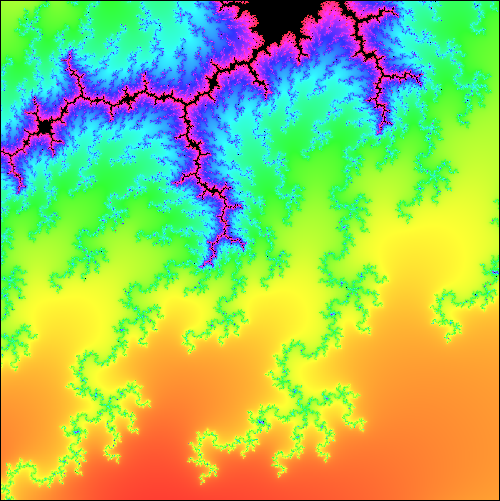

# Pybrot
Pybrot is a python package that you can use to create images of the mandelbrot set like this:

`Mandelbrot(autoMaxIter=False, maxIterations=128, samples=5000, drawRadius=1.5, coloringFunc=MandelColoring.IterativeColor)`

`Mandelbrot(x=-0.9230110468224410331799630273585336748656, y=0.3103593603697618780906159981443973705961, drawRadius=0.00001, samples=1000, blacknessLimit=0.025, coloringFunc=SmoothColor)`

# Installation
Pybrot is in the python package index. You can use pip to install pybrot.

`pip install pybrot`

# Use

First, import the package:

`from pybrot.Mandelbrot import Mandelbrot`

Then, you can initialise a mandelbrot object like so:

`m = Mandelbrot()`

Then you can call

`m.Show()`

to show the image, or use

`m.SaveImg("Mandelbrot.png")`

to save it as an image.

# DIY

The process described above creates the same image of the mandelbrot set each time. The Mandelbrot object initialiser takes a lot of arguments which you can use to customise the image that is produced. All arguments are keyword arguments.

The x and y coördinates determine what point the image is centered around.

`x (default: 0)`

`y (default: 0)`

The drawing radius determines how zoomed in the image is. The bigger the drawing radius, the more zoomed out the image.

`drawRadius (default: 2)`

To calculate whether a point lies within the mandelbrot set, a maximum iteration amount is required. If you are not sure what that means, or how that works, there is an option (which is enabled by default) to automatically calculate the ideal maximum iteration. 

`autoMaxIter (default: True)`

When calculating the ideal number of maximum iterations, the module uses the amount of black pixels in the image in proportion to the total amount of pixels. You can change the maximum percentage of black pixels in the image by using the blackness limit. This is set to 0.3 (=30%) by default, which guarantees that the image will not contain more than 30% black pixels.

`blacknessLimit (default: 0.3)`

If you want to manually select a maximum iteration value, that is also possible (but remember to set autoMaxIter to False).

`maxIterations (default: 64)`

When calculating whether a point lies within the mandelbrot set, you also need to specify the escape radius. If the absolute value of the point is bigger than this value before reaching the maximum iterations (see above), then it's considered outside of the set.

`escapeRadius (default: 4)`

Depending on how high quality you want your image to be, you can set the samples argument. This argument defines how many rows and columns of pixels are generated and have a color calculated for it, and thus the resolution of the image. This value also has a dramatic effect on performance (n times more samples means n² times the calculations).

`samples (default: 250)`

Lastly, if you would like to create your own coloring function to create even more unique images, you can use the coloringFunc argument to specify your own function, or you can use one of the functions defined in the MandelColoring script.

`coloringFunc (default: IterativeColor)`